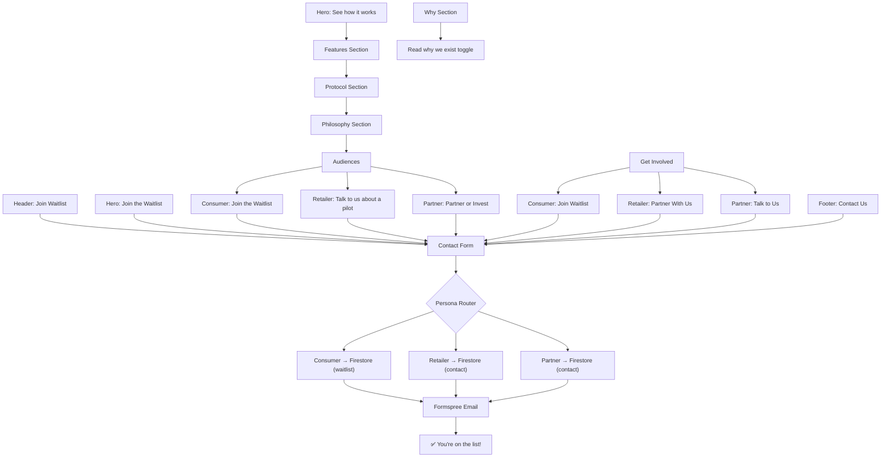

# EnviroPay — Marketing & Business Metrics Tracker

> **Purpose**: End-to-end mapping of every quantitative claim, marketing statement, and business metric across the website — from Header to Footer. **Verified against the EnviroPay Pitch Deck (16-page PDF) as the single source of truth.**  
> **Date**: 2026-04-12 (Updated with pitch deck verification)  
> **Scope**: All 10 sections rendered in `app/page.tsx` + shared components  
> **Source of Truth**: `docs/EnviroPay Pitch Deck - EP (1).pdf`

---

## Verification Legend

| Status | Meaning |
|--------|---------|
| ✅ **DECK-VERIFIED** | Claim matches pitch deck verbatim |
| ⚠️ **DECK-CONFLICT** | Claim contradicts pitch deck data |
| 🔴 **NOT IN DECK** | Claim has no backing in the pitch deck — needs external source or removal |
| 🟡 **DECK-ADJACENT** | Claim is loosely supported by deck themes but not stated as a specific number |
| 🏷️ **N/A** | Not a verifiable metric (brand copy, CTA, UX element) |

---

## Pitch Deck — Canonical Data Points (Verbatim)

> [!IMPORTANT]
> These are the **only** quantitative claims that appear in the pitch deck. Every number on the website must trace back to one of these, or be flagged as a gap.

| # | Metric | Exact Deck Value | Deck Page |
|---|--------|-----------------|-----------|
| D-1 | Containers annually (UK) | **30–40 billion** | P3, P10 |
| D-2 | Return locations | **1000s** | P3, P10 |
| D-3 | Circulating deposits | **£6–8 billion** | P3, P10 |
| D-4 | UK DRS expected launch | **2027** | P3 |
| D-5 | Revenue per container | **0.4p – 0.7p** | P8 |
| D-6 | 1% market share | **300M containers → £1.5M revenue** | P10 |
| D-7 | 5% market share | **1.5B containers → £7.5M revenue** | P10 |
| D-8 | 10% market share | **3B containers → £15M revenue** | P10, P14 |
| D-9 | Revenue pathway headline | **£100M+** | P14 |
| D-10 | Traction — RVM partner | **ACO Recycling** (successful integration) | P9 |
| D-11 | Stage 1 pilot | **10 machines** | P9 |
| D-12 | Stage 2 pilot | **50–100 machines** | P9 |
| D-13 | Stage 3 | **National Scaling** | P9 |
| D-14 | Team — CEO | **Josh Illingworth** (12+ years) | P13 |
| D-15 | Team — COO | **Daniel Thomas** | P13 |
| D-16 | Team — CTO | **Dannell Kobby** (10+ years) | P13 |
| D-17 | Team — CPO | **Enoch Offei** (nearly 10 years) | P13 |
| D-18 | Revenue growth | **33.3%** | P14 |
| D-19 | Competitors (physical infra) | **TOMRA, Envipco, Recyclever** | P11 |
| D-20 | Contact email | **hello@enviropay.uk** | P16 |
| D-21 | Domain | **enviropay.uk** | P16 |

### Pitch Deck Key Features (Qualitative — Product Claims)
| Feature | Deck Source | Page |
|---------|-----------|------|
| Instant wallet credit | P5 — "Key Features" | P5 |
| Bank withdrawals via Faster Payments | P5 — "Key Features" | P5 |
| Real-time transaction tracking | P5 — "Key Features" | P5 |
| Recycling impact tracking | P5 — "Key Features" | P5 |
| Receive deposit refunds instantly | P6 — "Consumer App" | P6 |
| Track recycling earnings | P6 — "Consumer App" | P6 |
| Locate return points | P6 — "Consumer App" | P6 |
| Withdraw funds | P6 — "Consumer App" | P6 |
| Machine monitoring | P6 — "Operator Dashboard" | P6 |
| Reconciliation tools | P6 — "Operator Dashboard" | P6 |
| Fraud alerts | P6 — "Operator Dashboard" | P6 |
| APIs connecting RVM, POS, settlement | P6 — "Integration Platform" | P6 |
| Enterprise integrations (RVM, retailers, operators) | P8 — "Additional revenue" | P8 |
| Data services (analytics for councils) | P8 — "Additional revenue" | P8 |

---

## 1. HEADER (`components/shared/Header.tsx`)

| # | Statement / Element | Type | Deck Status | Notes |
|---|---------------------|------|-------------|-------|
| H-1 | **"EnviroPay"** wordmark | 🏷️ | 🏷️ N/A | Brand identity — not a metric |
| H-2 | Nav: "How It Works" → `#features` | 🎯 | 🏷️ N/A | UX element |
| H-3 | Nav: "For Consumers" → `#consumers` | 🎯 | 🏷️ N/A | UX element |
| H-4 | Nav: "For Retailers" → `#retailers` | 🎯 | 🏷️ N/A | UX element |
| H-5 | Nav: "Our Mission" → `#why` | 🎯 | 🏷️ N/A | UX element |
| H-6 | **"Join Waitlist"** button → `#contact` | 🎯 | 🏷️ N/A | UX element |
| H-7 | Section-aware CTA theming | 💬 | 🏷️ N/A | UX element |

> No verifiable metrics in the Header. All elements are brand/UX.

---

## 2. HERO SECTION (`components/sections/HeroSection.tsx`)

| # | Statement / Element | Type | Deck Status | Notes |
|---|---------------------|------|-------------|-------|
| HR-1 | **"Recycle. Earn. Spend."** | 🏷️ | 🏷️ N/A | Tagline |
| HR-2 | **"Scan your bottle. Get paid. Spend or withdraw — instantly."** | 💬 | 🟡 DECK-ADJACENT | Deck P5: "instant wallet credit", P6: "Withdraw funds". The word "instantly" is supported by deck's use of "instant digital refunds" (P5). |
| HR-3 | **"The UK's deposit-return wallet. Built for 2027."** | ⏱️ | ✅ **DECK-VERIFIED** | Deck P3: "DRS expected in 2027" |
| HR-4 | **"Join the Waitlist"** button | 🎯 | 🏷️ N/A | UX element |
| HR-5 | **"See how it works"** button | 🎯 | 🏷️ N/A | UX element |
| HR-6 | App preview phone mockup | 💬 | 🏷️ N/A | Visual element |
| HR-7 | Auto-carousel (Scan, Earn, Spend, Withdraw) | 💬 | 🟡 DECK-ADJACENT | Deck P6 lists: "Receive deposit refunds instantly, Track recycling earnings, Locate return points, Withdraw funds" |

### Hero Verification Summary
| Claim | Website Value | Deck Value | Status |
|-------|-------------|------------|--------|
| 2027 launch | 2027 | "expected in 2027" (P3) | ✅ MATCH |

---

## 3. FEATURES SECTION (`components/sections/FeaturesSection.tsx`)

| # | Statement / Element | Type | Deck Status | Notes |
|---|---------------------|------|-------------|-------|
| FT-1 | **"How it works"** | 🏷️ | 🏷️ N/A | Section title |
| FT-2 | **"Four steps. One mission."** | 💬 | 🏷️ N/A | Marketing copy |
| FT-3 | **DiagnosticShuffler** widget | 💬 | 🏷️ N/A | UX element |
| FT-4 | **"£0.20 deposit confirmed"** (typewriter) | 📊 | 🔴 **NOT IN DECK** | **The pitch deck does not state a per-container deposit amount.** The deck only states revenue of "0.4p–0.7p per container processed" (P8), which is EnviroPay's fee, NOT the consumer deposit. The £0.20 figure is not sourced in the deck. |
| FT-5 | **CursorScheduler** widget | 💬 | 🏷️ N/A | UX element |
| FT-6 | **"Confirmed in under a second"** | ⏱️ | 🔴 **NOT IN DECK** | No scan speed claim exists in the deck. |
| FT-7 | **"Drop it in a designated bin or reverse vending machine."** | 💬 | 🟡 DECK-ADJACENT | Deck P9: "Successful integration with ACO Recycling reverse vending machine" |
| FT-8 | **"Your deposit refund hits your EnviroWallet instantly."** | ⏱️ | 🟡 DECK-ADJACENT | Deck P5: "instant wallet credit", P5: "Consumers receive instant digital refunds" |
| FT-9 | **"Spend in-app, withdraw to bank, or donate to an eco charity."** | 💬 | 🟡 DECK-ADJACENT | Deck P5: "bank withdrawals via Faster Payments". **"Donate to eco charity" is NOT in deck.** |

### Features Verification Summary
| Claim | Website Value | Deck Value | Status | Action |
|-------|-------------|------------|--------|--------|
| £0.20 per container deposit | £0.20 | **Not stated** | 🔴 GAP | Need external UK DRS source for deposit amount |
| Scan speed | "under a second" | **Not stated** | 🔴 GAP | Need product benchmark or remove |
| Instant refund | "instantly" | "instant wallet credit" (P5) | 🟡 Loosely supported | Acceptable |
| Donate to eco charity | "donate to an eco charity" | **Not stated** | 🔴 GAP | Feature not in deck — verify with product team |

---

## 4. PROTOCOL SECTION (`components/sections/ProtocolSection.tsx`)

| # | Statement / Element | Type | Deck Status | Notes |
|---|---------------------|------|-------------|-------|
| PT-1 | **"The EnviroPay Protocol"** | 🏷️ | 🏷️ N/A | Section title |
| PT-2 | **"Scan → Return → Earn → Use"** | 💬 | 🟡 DECK-ADJACENT | Deck P2 shows "Return, Scan, Earn" as visual flow |
| PT-3 | **"Scan any barcode"** | 💬 | 🔴 **NOT IN DECK** | Deck does not mention barcode scanning specifically |
| PT-4 | **"Drop it at any EnviroPay Return Point"** | 💬 | 🟡 DECK-ADJACENT | Deck P3: "thousands of return locations" |
| PT-5 | **"Deposit hits your wallet automatically"** | ⏱️ | 🟡 DECK-ADJACENT | Deck P5: "instant wallet credit" |
| PT-6 | **"Spend, save, or give back"** | 💬 | 🟡 DECK-ADJACENT | Deck P5 supports spend/withdraw, "give back" not in deck |
| PT-7 | Protocol card scroll animations | 💬 | 🏷️ N/A | UX element |

### Protocol Verification Summary
No hard metrics in this section. All claims are qualitative process descriptions loosely aligned with deck content.

---

## 5. PHILOSOPHY SECTION (`components/sections/PhilosophySection.tsx`)

| # | Statement / Element | Type | Deck Status | Notes |
|---|---------------------|------|-------------|-------|
| PH-1 | **"The problem is bigger than bottles."** | 💬 | 🏷️ N/A | Marketing copy |
| PH-2 | **"Only 44% of plastic bottles in the UK are recycled"** | 📊 | 🔴 **NOT IN DECK** | This statistic does not appear anywhere in the pitch deck. |
| PH-3 | **"14 billion"** — Drinks containers sold annually in UK | 📊 | ⚠️ **DECK-CONFLICT** | **Deck says "30–40 billion" (P3, P10).** The website's "14 billion" directly contradicts the deck. |
| PH-4 | **"7.7 billion"** — Bottles not recycled per year | 📊 | 🔴 **NOT IN DECK** | Derived from the already-incorrect 14B figure. |
| PH-5 | **"£1.6 billion"** — Value of unrecycled material | 📊 | 🔴 **NOT IN DECK** | Deck states "£6–8 billion circulating deposits" (P3, P10) — a completely different metric and value. |
| PH-6 | Environmental impact hotspot map | 💬 | 🏷️ N/A | Visual element |
| PH-7 | **"200 years"** — Plastic decomposition time | 📊 | 🔴 **NOT IN DECK** | Common environmental fact but not sourced in deck. |
| PH-8 | **"8 million tonnes"** — Plastic entering oceans | 📊 | 🔴 **NOT IN DECK** | Common environmental fact but not sourced in deck. |

### Philosophy Verification Summary

> [!CAUTION]
> **This section has the highest concentration of unverified and conflicting data on the entire website.** Of 6 hard metrics, ZERO are verified by the pitch deck. One directly contradicts it.

| Claim | Website Value | Deck Value | Status | Action Required |
|-------|-------------|------------|--------|----------------|
| UK recycling rate | 44% | **Not stated** | 🔴 GAP | Need DEFRA or WRAP citation, or remove |
| Containers annually | **14 billion** | **30–40 billion** (P3, P10) | ⚠️ **CONFLICT** | Must align with deck: use "30–40 billion" or clarify scope |
| Unrecycled bottles | 7.7 billion | **Not stated** | 🔴 GAP | Derived from wrong base — recalculate if 44% is verified |
| Material value | £1.6 billion | **£6–8 billion** circulating deposits (P3, P10) | ⚠️ **CONFLICT** | These are different metrics — clarify what "value of unrecycled material" means vs "circulating deposits" |
| Decomposition time | 200 years | **Not stated** | 🔴 GAP | Common fact — add external citation (e.g., WWF, UNEP) |
| Ocean plastic | 8 million tonnes | **Not stated** | 🔴 GAP | Common fact — add external citation (e.g., UNEP) |

---

## 6. AUDIENCE SECTIONS (`components/sections/AudienceSections.tsx`)

### 6A — CONSUMERS Sub-Section

| # | Statement / Element | Type | Deck Status | Notes |
|---|---------------------|------|-------------|-------|
| AU-C1 | **"For consumers"** | 🏷️ | 🏷️ N/A | Section title |
| AU-C2 | **"One app, three moves: scan it, return it, spend it."** | 💬 | 🏷️ N/A | Marketing copy |
| AU-C3 | **"Your refund hits your wallet before you leave the store."** | ⏱️ | 🟡 DECK-ADJACENT | Deck P5: "Consumers receive instant digital refunds when returning containers" |
| AU-C4 | **EnviroWallet** balance ticker (£4.60) | 💬 | 🏷️ N/A | Demo/visual element |
| AU-C5 | **"Instant Scan"** – "Point. Confirm. Done." | ⏱️ | 🔴 **NOT IN DECK** | No scan speed claim in deck |
| AU-C6 | **"Flexible Cash Out"** — "Bank, spend, or donate." | 💬 | 🟡 DECK-ADJACENT | Deck P5: "bank withdrawals via Faster Payments". "Donate" not in deck. |
| AU-C7 | **"Impact Score"** — "Track your eco contribution." | 💬 | ✅ **DECK-VERIFIED** | Deck P5: "recycling impact tracking" |
| AU-C8 | **"Find Returns"** — "Nearest spot in seconds." | ⏱️ | ✅ **DECK-VERIFIED** | Deck P6: "Locate return points" (Consumer App feature) |
| AU-C9 | **"Return Points Near You"** — MiniMap | 💬 | 🟡 DECK-ADJACENT | Deck P6: "Locate return points" |
| AU-C10 | 📊 **£0.20** — "Per Container" | 📊 | 🔴 **NOT IN DECK** | **Deck does not state the deposit amount.** Only states EnviroPay's fee: 0.4p–0.7p (P8). |
| AU-C11 | 📊 **500+** — "Return Points" | 📊 | 🔴 **NOT IN DECK** | **Deck says "1000s" of return locations (P3, P10) — different number and qualifier.** |
| AU-C12 | 📊 **3s** — "To Cash Out" | ⏱️ | 🔴 **NOT IN DECK** | **No cash-out speed claim exists in the deck.** |
| AU-C13 | **"Join the Waitlist"** button | 🎯 | 🏷️ N/A | UX element |

### Consumer Metrics Verification

> [!WARNING]
> The three animated stat counters (£0.20, 500+, 3s) — the most visually prominent data points for consumers — are **all unverified by the pitch deck**.

| Claim | Website Value | Deck Value | Status | Action Required |
|-------|-------------|------------|--------|----------------|
| Deposit per container | £0.20 | **Not stated** | 🔴 GAP | Need UK DRS legislation source |
| Return points count | 500+ | **"1000s"** (P3, P10) | ⚠️ **CONFLICT** | Website says 500+, deck says "1000s" — these can't both be right |
| Cash-out speed | 3s | **Not stated** | 🔴 GAP | Need product benchmark or remove |
| "Before you leave the store" | Instant | "instant digital refunds" (P5) | 🟡 Loosely supported | — |

---

### 6B — RETAILERS Sub-Section

| # | Statement / Element | Type | Deck Status | Notes |
|---|---------------------|------|-------------|-------|
| AU-R1 | **"For retailers"** | 🏷️ | 🏷️ N/A | Section title |
| AU-R2 | **"Be DRS-ready from day one."** | 💬 | 🟡 DECK-ADJACENT | Deck P4 identifies retailer problems: "reconciliation complexity, operational overhead" |
| AU-R3 | **"Drive footfall, reduce return friction, see real-time performance."** | 💬 | 🟡 DECK-ADJACENT | Deck P12: "More Retailers → More Users → More Integrations" (network effects) |
| AU-R4 | **BEFORE**: "Sorry, our machine is broken…" | 💬 | 🏷️ N/A | Illustrative storytelling |
| AU-R5 | **AFTER**: "Drop it in the bin, refund's already in your wallet." | 💬 | 🏷️ N/A | Illustrative storytelling |
| AU-R6 | **Dashboard mock**: "Returns today: 47", "+12%" | 📊 | 🔴 **NOT IN DECK** | **Mock data — illustrative only.** Deck mentions "Operator Dashboard" (P6) but no specific stats. |
| AU-R7 | **Dashboard mock**: "Avg. time: 8s", "-3s" | 📊 | 🔴 **NOT IN DECK** | **Mock data — no processing time claim in deck.** |
| AU-R8 | **Dashboard mock**: "Satisfaction: 96%", "+4%" | 📊 | 🔴 **NOT IN DECK** | **Mock data — no satisfaction metric in deck.** |
| AU-R9 | **"DRS-compliant from launch"** | 💬 | 🟡 DECK-ADJACENT | Implied by deck's DRS positioning |
| AU-R10 | **"Drive repeat visits with cashback"** | 💬 | 🔴 **NOT IN DECK** | "Cashback" not mentioned in deck |
| AU-R11 | **"Real-time analytics & compliance reporting"** | 💬 | 🟡 DECK-ADJACENT | Deck P6: "Reconciliation tools", P8: "analytics for councils, reporting tools" |
| AU-R12 | **"Talk to us about a pilot"** button | 🎯 | 🏷️ N/A | UX element |

### Retailer Dashboard Mock Note
> [!NOTE]
> The RetailerDashboard UI is explicitly a **mock**. The numbers (47, 8s, 96%) are illustrative. However, the deck (P6) confirms the **existence** of an "Operator Dashboard" product with "Machine monitoring, Reconciliation tools, Fraud alerts" — so the concept is deck-verified, just not the specific numbers.

---

### 6C — PARTNERS & INVESTORS Sub-Section

| # | Statement / Element | Type | Deck Status | Notes |
|---|---------------------|------|-------------|-------|
| AU-P1 | **"For partners & investors"** | 🏷️ | 🏷️ N/A | Section title |
| AU-P2 | **"Build — or back — the connected deposit-return infrastructure…"** | 💬 | 🟡 DECK-ADJACENT | Deck P7: "EnviroPay sits at the center connecting the recycling infrastructure to digital payments" |
| AU-P3 | 📊 **£1.6B** — "UK DRS Market Size" | 📈 | 🔴 **NOT IN DECK** | **This figure does not appear in the deck.** Deck states "£6–8 billion circulating deposits" (P3, P10). The deck's revenue projections max at £15M at 10% share (P10, P14). |
| AU-P4 | 📊 **2027** — "UK DRS Launch Year" | ⏱️ | ✅ **DECK-VERIFIED** | Deck P3: "DRS expected in 2027" |
| AU-P5 | 📊 **67M** — "UK Population" | 📈 | 🔴 **NOT IN DECK** | **Not mentioned in the deck.** Common knowledge but not sourced. |
| AU-P6 | 📊 **4.7B** — "Containers / Year" | 📈 | ⚠️ **DECK-CONFLICT** | **Deck says "30–40 billion" (P3, P10)**, not 4.7B. Website's 4.7B appears nowhere in the deck. |
| AU-P7 | **Investors tab**: "We're raising pre-seed…" | 💬 | 🟡 DECK-ADJACENT | Deck is itself a fundraising document |
| AU-P8 | **RVM Operators tab**: "API-first, instant settlement." | 💬 | ✅ **DECK-VERIFIED** | Deck P6: "APIs connecting RVM machines, POS systems and settlement infrastructure" |
| AU-P9 | **Return Point Partners tab**: "Increase footfall…" | 💬 | 🟡 DECK-ADJACENT | Network effects theme (P12) |
| AU-P10 | **Ecosystem Partners tab**: "Interoperability…" | 💬 | 🟡 DECK-ADJACENT | Deck P6: "Integration Platform" |
| AU-P11 | **"Partner or Invest"** button | 🎯 | 🏷️ N/A | UX element |
| AU-P12 | Accordion: "reliability, traceability…" | 💬 | 🏷️ N/A | Marketing copy |
| AU-P13 | Accordion: "raising to accelerate…" | 💬 | 🟡 DECK-ADJACENT | Deck is fundraising document |

### Partner Market Data Verification

> [!CAUTION]
> **The Partners section's headline market data is the most investor-facing content on the site, and it conflicts with the pitch deck.**

| Claim | Website Value | Deck Value | Status | Action Required |
|-------|-------------|------------|--------|----------------|
| UK DRS Market Size | **£1.6B** | **Not stated** (Deck: £6–8B circulating deposits) | 🔴 GAP | Figure does not exist in deck. Remove, replace, or externally source. |
| DRS Launch Year | 2027 | "expected in 2027" (P3) | ✅ MATCH | — |
| UK Population | 67M | **Not stated** | 🔴 GAP | ONS data — verifiable but not in deck |
| Containers / Year | **4.7B** | **30–40 billion** (P3, P10) | ⚠️ **CONFLICT** | Website says 4.7B, deck says 30–40B. Massive discrepancy. |

---

## 7. WHY SECTION (`components/sections/WhySection.tsx`)

| # | Statement / Element | Type | Deck Status | Notes |
|---|---------------------|------|-------------|-------|
| WY-1 | **"Recycling reimagined for real life."** | 🏷️ | 🏷️ N/A | Tagline |
| WY-2 | **"Building the digital layer for the UK's deposit return scheme."** | 💬 | ✅ **DECK-VERIFIED** | Deck P2: "EnviroPay is building the digital financial infrastructure that powers modern recycling systems" |
| WY-3 | 📊 **2027** — "UK DRS target" | ⏱️ | ✅ **DECK-VERIFIED** | Deck P3: "expected in 2027" |
| WY-4 | 📊 **73%** — "want easier returns" | 📈 | 🔴 **NOT IN DECK** | **This statistic does not appear anywhere in the pitch deck.** |
| WY-5 | 📊 **4,700M** — "containers / year" | 📈 | ⚠️ **DECK-CONFLICT** | **Deck says "30–40 billion" (P3, P10).** 4,700M = 4.7B — does not match deck. |
| WY-6 | **"The UK is approaching a major shift…"** | 💬 | 🟡 DECK-ADJACENT | Deck P3: "UK is launching a nationwide DRS" |
| WY-7 | **"The experience has to be easy…"** | 💬 | 🟡 DECK-ADJACENT | Deck P4 lists consumer pain: "inconvenient refunds, lost vouchers" |
| WY-8 | **"Make recycling feel as normal as buying a drink"** | 🏷️ | 🏷️ N/A | Vision statement |
| WY-9 | **"Read why we exist"** toggle | 🎯 | 🏷️ N/A | UX element |
| WY-10 | **"UK-based digital platform…bottles and cans."** | 💬 | ✅ **DECK-VERIFIED** | Deck P5: "EnviroPay provides the digital wallet for recycling refunds" |
| WY-11 | **"The upcoming deposit return scheme…"** | 💬 | ✅ **DECK-VERIFIED** | Deck P3 |
| WY-12 | **"We asked the UK…"** | 📈 | 🔴 **NOT IN DECK** | **No survey or research data appears in the deck.** |
| WY-13 | **"transparent, connected deposit-return network…"** | 💬 | 🟡 DECK-ADJACENT | Deck P7: "connecting the recycling infrastructure to digital payments" |
| WY-14 | **Founding Team** — 4 members | 💬 | ✅ **DECK-VERIFIED** | Deck P13: Josh Illingworth, Daniel Thomas, Dannell Kobby, Enoch Offei |
| WY-15 | **"Four founders. One shared conviction."** | 🏷️ | 🏷️ N/A | Tagline |

### Why Section Team Verification (Deck P13)

| Website | Deck | Match? |
|---------|------|--------|
| Josh Illingworth — CEO & Co-Founder | Josh Illingworth — CEO | ✅ Name match. Deck: "12+ years in app development, product design, and strategic leadership" |
| Daniel Joseph Thomas — COO & Co-Founder | Daniel Thomas — COO | ✅ Name match. Website adds middle name "Joseph". Deck: "deep expertise in sustainability, circular economy infrastructure, and operational strategy" |
| Dannell Kobby — CTO & Co-Founder | Dannell Kobby — CTO | ✅ Name match. Deck: "10+ years spanning fintech, insurance platforms, and AI-powered systems" |
| Enoch Offei — CPO & Co-Founder | Enoch Offei — CPO | ✅ Name match. Deck: "nearly 10 years designing digital products in fintech, digital wallets, consumer platforms" |

> [!NOTE]
> Previous walkthrough noted possible name discrepancies ("Benjamin Thomas", "Marques Thomas"). **The pitch deck confirms: Josh Illingworth, Daniel Thomas, Dannell Kobby, Enoch Offei.** Website names match the deck.

### Why Section Data Verification
| Claim | Website Value | Deck Value | Status | Action Required |
|-------|-------------|------------|--------|----------------|
| 73% want easier returns | 73% | **Not stated** | 🔴 GAP | No source. Remove or cite external survey. |
| 2027 DRS target | 2027 | "expected in 2027" (P3) | ✅ MATCH | — |
| 4,700M containers | 4,700M (4.7B) | **30–40B** (P3, P10) | ⚠️ CONFLICT | Align with deck |
| "We asked the UK" | Research claim | **Not stated** | 🔴 GAP | No research data in deck. Cite or remove. |

---

## 8. GET INVOLVED SECTION (`components/sections/GetInvolvedSection.tsx`)

| # | Statement / Element | Type | Deck Status | Notes |
|---|---------------------|------|-------------|-------|
| GI-1 | **"Get involved"** | 🏷️ | 🏷️ N/A | Section title |
| GI-2 | **"Launching in 2027"** | ⏱️ | ✅ **DECK-VERIFIED** | Deck P3 |
| GI-3 | **"Get paid for recycling"** | 💬 | 🟡 DECK-ADJACENT | Deck P5: "Consumers receive instant digital refunds" |
| GI-4 | **"Free EnviroWallet account"** | 💬 | 🔴 **NOT IN DECK** | Deck does not mention pricing or "free" tier |
| GI-5 | **"Scan & return at any EnviroPoint"** | 💬 | 🟡 DECK-ADJACENT | "EnviroPoint" branding not in deck |
| GI-6 | **"Withdraw to your bank or donate"** | 💬 | 🟡 DECK-ADJACENT | Deck P5: "bank withdrawals via Faster Payments". "Donate" not in deck. |
| GI-7 | **"Track your environmental impact"** | 💬 | ✅ **DECK-VERIFIED** | Deck P5: "recycling impact tracking" |
| GI-8 | Consumer CTA | 🎯 | 🏷️ N/A | UX element |
| GI-9 | **"Be DRS-ready from day one"** | 💬 | 🟡 DECK-ADJACENT | Implied by deck's DRS 2027 positioning |
| GI-10 | **"Plug-in return point integration"** | 💬 | 🟡 DECK-ADJACENT | Deck P6: "APIs connecting RVM machines, POS systems" |
| GI-11 | **"Drive footfall with EnviroPay users"** | 💬 | 🟡 DECK-ADJACENT | Deck P12: Network effects theme |
| GI-12 | **"Real-time dashboard & analytics"** | 💬 | ✅ **DECK-VERIFIED** | Deck P6: "Operator Dashboard — Machine monitoring, Reconciliation tools" + P8: "analytics for councils" |
| GI-13 | **"Dedicated onboarding support"** | 💬 | 🔴 **NOT IN DECK** | No onboarding support claim in deck |
| GI-14 | **"Early-access partner programme"** | 💬 | 🔴 **NOT IN DECK** | No partner programme structure in deck |
| GI-15 | Retailer CTA | 🎯 | 🏷️ N/A | UX element |
| GI-16 | **"Build the UK's return infrastructure"** | 💬 | 🟡 DECK-ADJACENT | Deck P7 theme |
| GI-17 | **"API access for RVM operators"** | 💬 | ✅ **DECK-VERIFIED** | Deck P6: "APIs connecting RVM machines" |
| GI-18 | **"White-label wallet integration"** | 💬 | 🔴 **NOT IN DECK** | "White-label" is nowhere in the deck |
| GI-19 | **"Revenue-share model"** | 💬 | 🔴 **NOT IN DECK** | Deck P8 describes "0.4p–0.7p per container" model, no mention of revenue-sharing |
| GI-20 | **"Early investor information"** | 💬 | 🟡 DECK-ADJACENT | Deck is fundraising document |
| GI-21 | Partner CTA | 🎯 | 🏷️ N/A | UX element |

### Get Involved Unverified Claims
| Claim | Status | Action |
|-------|--------|--------|
| "Free EnviroWallet account" | 🔴 NOT IN DECK | Verify pricing with team |
| "Dedicated onboarding support" | 🔴 NOT IN DECK | Verify service commitment |
| "Early-access partner programme" | 🔴 NOT IN DECK | Verify programme structure |
| "White-label wallet integration" | 🔴 NOT IN DECK | Verify product capability |
| "Revenue-share model" | 🔴 NOT IN DECK | Deck says fee per container, not revenue share |

---

## 9. CONTACT SECTION (`components/sections/ContactSection.tsx`)

| # | Statement / Element | Type | Deck Status | Notes |
|---|---------------------|------|-------------|-------|
| CT-1 | **"Let's talk"** | 🏷️ | 🏷️ N/A | Section title |
| CT-2 | **"Tell us who you are…"** | 💬 | 🏷️ N/A | UX copy |
| CT-3 | Persona pills (consumer/retailer/partner) | 🎯 | 🏷️ N/A | UX element |
| CT-4–6 | Submit buttons per persona | 🎯 | 🏷️ N/A | UX elements |
| CT-9 | **"You're on the list!"** | 💬 | 🏷️ N/A | Confirmation copy |
| CT-10 | **"We'll be in touch soon."** | ⏱️ | 🔴 **NOT IN DECK** | No response time SLA in deck |
| CT-11 | **"No spam. Unsubscribe anytime."** | 💬 | 🏷️ N/A | Trust copy |

> No verifiable metrics in the Contact section. All elements are UX/form copy.

---

## 10. FOOTER (`components/shared/Footer.tsx`)

| # | Statement / Element | Type | Deck Status | Notes |
|---|---------------------|------|-------------|-------|
| FT-1 | **"EnviroPay"** wordmark | 🏷️ | 🏷️ N/A | Brand identity |
| FT-2 | **"The UK's digital deposit-return platform…"** | 🏷️ | ✅ **DECK-VERIFIED** | Deck P5/P16: "digital wallet for recycling refunds", "digital payments layer powering recycling infrastructure" |
| FT-3 | **"Coming 2027 · Ahead of UK DRS"** | ⏱️ | ✅ **DECK-VERIFIED** | Deck P3 |
| FT-4 | Address: **"7-75 Shelton St, Covent Garden, London WC2H 9JQ"** | 💬 | 🔴 **NOT IN DECK** | Deck does not mention a physical address |
| FT-5–8 | Navigation links | 🎯 | 🏷️ N/A | UX elements |
| FT-9–10 | Legal page links | 🎯 | 🏷️ N/A | Legal compliance |
| FT-13 | LinkedIn link | 🎯 | 🏷️ N/A | Social element |
| FT-15 | **"Info@EnviroPay.uk"** | 🎯 | ⚠️ **DECK-CONFLICT** | **Deck P16 says "hello@enviropay.uk"**, not "info@enviropay.uk" |
| FT-16 | **"© 2026 EnviroPay Ltd."** | 💬 | 🏷️ N/A | Legal boilerplate |
| FT-17 | **"A world free from waste."** | 🏷️ | 🏷️ N/A | Tagline |

### Footer Verification Summary
| Claim | Website Value | Deck Value | Status | Action |
|-------|-------------|------------|--------|--------|
| Email contact | info@enviropay.uk | **hello@enviropay.uk** (P16) | ⚠️ CONFLICT | Align — which email is canonical? |
| 2027 timeline | 2027 | "expected in 2027" (P3) | ✅ MATCH | — |
| Company address | 7-75 Shelton St | **Not stated** | 🔴 GAP | Verify via Companies House |

---

## 11. CROSS-SECTION DATA CONSISTENCY AUDIT (Pitch-Deck Grounded)

> [!IMPORTANT]
> Every claim below is checked against the pitch deck. Conflicts and gaps are clearly marked.

### Repeated Claims Matrix (Grounded to Deck)

| # | Claim | Website Value | Where on Website | Deck Value | Deck Page | Status |
|---|-------|-------------|-----------------|------------|-----------|--------|
| 1 | UK DRS launch year | 2027 | Hero, Partners, Why, GetInvolved, Footer | "expected in 2027" | P3 | ✅ **VERIFIED** |
| 2 | Containers per year | **14B** (Philosophy), **4.7B** (Partners, Why) | 3 sections | **30–40B** | P3, P10 | ⚠️ **BOTH WRONG** |
| 3 | Deposit per container | £0.20 | Features, Consumers | **Not stated** | — | 🔴 GAP |
| 4 | Market size | £1.6B | Philosophy, Partners | **Not stated** (£6–8B circulating deposits is different) | P3, P10 | 🔴 GAP |
| 5 | Return points | 500+ | Consumers | **"1000s"** | P3, P10 | ⚠️ **CONFLICT** |
| 6 | Cash-out speed | 3s | Consumers | **Not stated** | — | 🔴 GAP |
| 7 | % wanting easier returns | 73% | Why | **Not stated** | — | 🔴 GAP |
| 8 | Refund speed | "instantly" / "before you leave the store" | Features, Consumers | "instant wallet credit", "instant digital refunds" | P5 | ✅ **VERIFIED** (qualitative) |
| 9 | Team members | 4 founders | Why | 4 founders (P13) | P13 | ✅ **VERIFIED** |
| 10 | Contact email | info@enviropay.uk | Footer | **hello@enviropay.uk** | P16 | ⚠️ **CONFLICT** |
| 11 | Revenue model | Not shown | — | 0.4p–0.7p per container | P8 | Deck data not on website |
| 12 | Traction (ACO Recycling) | Not shown | — | "Successful integration with ACO Recycling" | P9 | Deck data not on website |
| 13 | Pilot roadmap (10→50-100→national) | Not shown | — | Stages 1-2-3 | P9 | Deck data not on website |
| 14 | Revenue scenario (10% → £15M) | Not shown | — | 3B containers → £15M annually | P10, P14 | Deck data not on website |
| 15 | Competitors | Not shown | — | TOMRA, Envipco, Recyclever | P11 | Deck data not on website |

---

## 12. MASTER GAP REGISTER

> [!CAUTION]
> **Summary of all metrics on the website that are NOT backed by the pitch deck.** Each needs either an external citation or stakeholder decision to keep/remove.

| # | Metric | Website Value | Website Location | Status | Recommended Action |
|---|--------|-------------|-----------------|--------|--------------------|
| G-1 | Containers annually | 14 billion | Philosophy | ⚠️ CONFLICT (Deck: 30–40B) | **Replace with deck value or cite different scope** |
| G-2 | Containers annually | 4.7 billion | Partners, Why | ⚠️ CONFLICT (Deck: 30–40B) | **Replace with deck value or cite different scope** |
| G-3 | UK recycling rate | 44% | Philosophy | 🔴 NOT IN DECK | Cite DEFRA/WRAP source or remove |
| G-4 | Unrecycled bottles | 7.7 billion | Philosophy | 🔴 NOT IN DECK | Derived from G-1 — invalid if G-1 is wrong |
| G-5 | Material value | £1.6 billion | Philosophy, Partners | 🔴 NOT IN DECK | Clarify: is this "market size" or "material value"? Neither matches deck's £6–8B. |
| G-6 | Deposit amount | £0.20 | Features, Consumers | 🔴 NOT IN DECK | Cite UK DRS legislation or government source |
| G-7 | Return points count | 500+ | Consumers | ⚠️ CONFLICT (Deck: "1000s") | Align with deck ("1000s") or clarify as EnviroPay-specific count |
| G-8 | Cash-out speed | 3 seconds | Consumers | 🔴 NOT IN DECK | Cite product benchmark or remove |
| G-9 | Survey stat | 73% | Why | 🔴 NOT IN DECK | Cite survey source (methodology, sample) or remove |
| G-10 | Decomposition time | 200 years | Philosophy | 🔴 NOT IN DECK | Cite WWF/UNEP or similar |
| G-11 | Ocean plastic | 8 million tonnes | Philosophy | 🔴 NOT IN DECK | Cite UNEP or similar |
| G-12 | UK Population | 67 million | Partners | 🔴 NOT IN DECK | Cite ONS. Safe stat but not in deck. |
| G-13 | Contact email | info@enviropay.uk | Footer | ⚠️ CONFLICT (Deck: hello@) | Decide canonical email |
| G-14 | Company address | 7-75 Shelton St | Footer | 🔴 NOT IN DECK | Verify via Companies House |
| G-15 | "We asked the UK" | Research claim | Why | 🔴 NOT IN DECK | Cite research or remove |
| G-16 | "Donate to eco charity" | Feature claim | Features, Consumers, GI | 🔴 NOT IN DECK | Verify feature in product roadmap |
| G-17 | "White-label wallet" | Feature claim | GetInvolved | 🔴 NOT IN DECK | Verify product capability |
| G-18 | "Revenue-share model" | Business model | GetInvolved | 🔴 NOT IN DECK | Deck says fee-per-container, not revenue share |
| G-19 | "Free EnviroWallet" | Pricing claim | GetInvolved | 🔴 NOT IN DECK | Verify pricing decision |
| G-20 | Scan speed | "under a second" | Features | 🔴 NOT IN DECK | Cite product benchmark or remove |
| G-21 | "Cashback" | Feature claim | Retailers | 🔴 NOT IN DECK | Not in deck — verify feature |
| G-22 | "Dedicated onboarding support" | Service claim | GetInvolved | 🔴 NOT IN DECK | Verify service commitment |
| G-23 | "Early-access partner programme" | Programme claim | GetInvolved | 🔴 NOT IN DECK | Verify programme structure |
| G-24 | RetailerDashboard stats | 47 returns, 8s, 96% | Retailers | 🔴 NOT IN DECK | Mock data — label clearly or verify |

**Total gaps: 24 | Conflicts: 4 | Verified: 8**

---

## 13. CTA FUNNEL MAP (Full Journey)

### Total CTA Count by Persona
| Persona | CTA Buttons on Page | Forms to Contact |
|---------|--------------------|--------------------|
| Consumer | 5 (Header, Hero, Audiences, GetInvolved, Footer) | 1 (Contact Section) |
| Retailer | 3 (Audiences, GetInvolved, Footer) | 1 (Contact Section) |
| Partner/Investor | 3 (Audiences, GetInvolved, Footer) | 1 (Contact Section) |
| **Total** | **11 CTAs** | **1 unified form** |

---

## 14. ANALYTICS IMPLEMENTATION CHECKLIST

| # | Event | Trigger | Priority |
|---|-------|---------|----------|
| 1 | `page_view` | Page load | 🔴 P0 |
| 2 | `scroll_depth` | 25%, 50%, 75%, 100% | 🔴 P0 |
| 3 | `section_view` | IntersectionObserver per section ID | 🔴 P0 |
| 4 | `cta_click` | Any CTA button (with label + persona) | 🔴 P0 |
| 5 | `form_submit` | Contact form submission (with persona) | 🔴 P0 |
| 6 | `form_error` | Validation error shown | 🟡 P1 |
| 7 | `persona_select` | Persona pill click | 🟡 P1 |
| 8 | `accordion_toggle` | Why section "Read why we exist" | 🟡 P1 |
| 9 | `team_member_click` | Team card opened | 🟡 P1 |
| 10 | `partner_tab_click` | Partner type tab changed | 🟡 P1 |
| 11 | `external_link_click` | LinkedIn, email, social | 🟡 P1 |
| 12 | `mobile_menu_open` | Hamburger menu toggled | 🟢 P2 |
| 13 | `app_preview_tab` | AppPreview carousel tab click | 🟢 P2 |

---

## 15. DECK DATA NOT USED ON WEBSITE

> [!TIP]
> The following pitch deck data points are **available but not currently shown on the website**. Consider adding them for stronger investor/partner credibility.

| # | Deck Data Point | Value | Deck Page | Potential Use |
|---|----------------|-------|-----------|---------------|
| U-1 | Revenue per container | 0.4p–0.7p | P8 | Business model transparency on Partners section |
| U-2 | 1% adoption = £1.5M revenue | £1.5M | P10 | Revenue projections on Partners section |
| U-3 | 5% adoption = £7.5M revenue | £7.5M | P10 | Revenue projections on Partners section |
| U-4 | 10% adoption = £15M revenue | £15M | P10, P14 | Revenue projections on Partners section |
| U-5 | £100M+ revenue pathway | £100M+ | P14 | Bold headline claim for Partners |
| U-6 | Traction: ACO Recycling integration | Named partner | P9 | Social proof / traction section |
| U-7 | Pilot: 10 → 50-100 → National | Roadmap | P9 | Traction/roadmap timeline |
| U-8 | Circulating deposits | £6–8 billion | P3, P10 | Replace "£1.6B" with this deck-verified figure |
| U-9 | Containers annually (UK) | 30–40 billion | P3, P10 | Replace 14B/4.7B with this deck-verified figure |
| U-10 | Competitors differentiation | TOMRA, Envipco, Recyclever = physical; EP = digital | P11 | Competitive positioning section |
| U-11 | Data services revenue | Analytics for councils, reporting for operators | P8 | Additional value proposition |
| U-12 | Network effects moat | More Retailers → More Users → More Integrations | P12 | Partner/investor pitch |
| U-13 | European expansion | European DRS systems, global infrastructure | P14 | Vision/ambition signaling |
| U-14 | Contact email | hello@enviropay.uk | P16 | Footer email correction |

---

> **Next Steps (Priority-ordered)**:
> 1. 🔴 **Fix CONFLICT G-1/G-2**: Replace 14B and 4.7B containers with deck's "30–40 billion" across Philosophy, Partners, Why sections
> 2. 🔴 **Fix CONFLICT G-5**: Replace £1.6B with contextually appropriate deck figure (£6–8B circulating deposits)
> 3. 🔴 **Fix CONFLICT G-7**: Align return points (500+ vs deck's "1000s")
> 4. 🔴 **Fix CONFLICT G-13**: Align email (info@ vs hello@)
> 5. 🔴 **Cite or remove G-3, G-6, G-9**: 44% recycling rate, £0.20 deposit, 73% survey — need external sources
> 6. 🟡 **Consider adding U-1 through U-14**: Deck data available but unused on website
> 7. 🟢 **Label G-24**: Mark RetailerDashboard stats as illustrative
